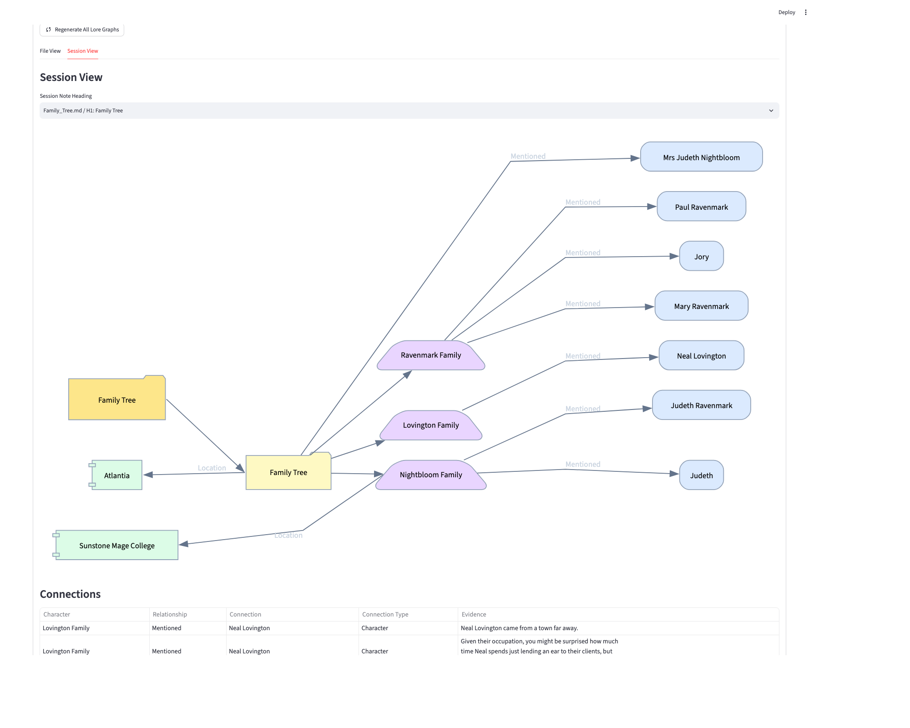

# Roleplaying Character Creator

A local Streamlit app for creating tabletop character sheets, organizing campaign lore, and visualizing relationships as knowledge graphs.

The app treats authored markdown in `world_building/lore` as the source of truth. Character sheets can be edited through the UI, places can be created as lore files, and derived graph JSON can be regenerated from the Markdown whenever needed.

- `world_building/` is intentionally ignored by git so each player can keep their own campaign data
- Generated runtime files are stored in `world_building/meta_data` while user-readable application docs are stored in `world_building/lore`
- Templates, specifications, and parsing rules are committed under `docs/`
- test lore examples live under `tests/fixtures`.

Backup lore files are stored in `world_building/backup` and are updated everytime the app is loaded.
A manual backup button has been added in the `Lore Import` Section for your convenience.

## What It Does

- Create and edit character sheets with stats, backstory, summary, details, and character connections.
- Extracts session notes with date and session title info from either Markdown or raw text files.
- Build per-character knowledge graphs from character sheets.
- Use graph data to explicitly populate summaries or rewrite backstories when desired.

### Highlights

- Import session notes from raw text or markdown file.
- Extract the knowledge graph from the character backstory.
- Suggest graph-backed wording updates for character summary and backstory to improve writing legibility.
- All your data is stored locally on your machine.
- Graph-backed rewrite helpers never overwrite human edits to your character files.
- Character creator does not enforce a specific character schema or stats system.

## Release Notes


| Version | Summary                                                                           |
| ------- | --------------------------------------------------------------------------------- |
| v1.0.0  | This release adds a dedicated Knowledge Graph UI using graphviz.                  |
| v0.1.0  | Packaged as a Streamlit app for local character sheets, campaign lore management. |

## Setup

The easiest way to run the app is:

```bash
./run_streamlit.sh
```

This helper script creates a local `.venv` environment if needed, installs the dependencies from `requirements.txt`, and starts the Streamlit app.

If you prefer to manage the environment manually, use:

```bash
python -m venv .venv
source .venv/bin/activate
pip install -r requirements.txt
streamlit run streamlit_app.py
```

## Knowledge Graph Views
Main Tab [Characters, Places, Session Notes]
- Characters: [Single Character, Party View]
- Places: [Location View, Heading View]
- Session Notes: [Location View, Directory File View]

### Project Screenshots



## Storage Source Of Truth

The repository uses committed project docs plus one ignored local workspace root:

- Only files under `world_building/lore` are treated as canonical authored campaign lore.
- Files under `world_building/import` are raw inputs and can be re-imported or reorganized.
- Files under `world_building/backup` are auto generated backups of lore and metadata which can be used for restoring old campaign notes and derived local state.
- Files under `world_building/meta_data` are derived or runtime data and can be rebuilt or regenerated from the lore.

## Project Layout

```text
docs/CHARACTER_TEMPLATE.md                  Character sheet template
docs/PLACE_TEMPLATE.md                      Place lore template
world_building/import/                      Raw markdown/text import staging area
world_building/lore/character_sheets/*.md   Authored character sheets
world_building/lore/character_sheets/*/BACKSTORY.md
                                            Alternate character sheet format
world_building/lore/places/*.md             Authored place lore
world_building/backup/                      Latest local Markdown backup
world_building/meta_data/character_metadata/*/PROFILE.json
                                            Runtime character metadata
world_building/meta_data/character_metadata/*/MEMORY.md
                                            Runtime memory notes
world_building/meta_data/character_graph/*.graph.json
                                            Derived per-character graph JSON
```

Everything under `world_building/` is local campaign material, runtime data, or generated output and should not be committed.

## Environmental Variables

The app works without any environment variables. By default, it reads and writes under `world_building/` in the repository root.

The `LOCAL_CHATBOT_` prefix is legacy naming from when this project started as a local chatbot.
The current app is the roleplaying lore and knowledge graph tool; the prefix remains because these are the names currently read by the code.

Feature and development flags:


| Variable                                        | Enabled Value               | Purpose                                                                                                                   |
| ----------------------------------------------- | --------------------------- | ------------------------------------------------------------------------------------------------------------------------- |
| `LOCAL_CHATBOT_DISABLE_LORE_BACKUPS`            | `1`, `true`, `yes`, or `on` | Skips the automatic backup that normally runs when the Streamlit app starts.                                              |
| `LOCAL_CHATBOT_ENABLE_GRAPH_REWRITES`           | `1`                         | Shows graph-backed summary and backstory rewrite controls in the character editor.                                        |
| `LOCAL_CHATBOT_ENABLE_ATTRIBUTE_GRAPH_OVERRIDE` | `1`                         | Shows the internal attribute graph override editor. This is a maintenance/debug surface, not part of the normal app flow. |

Test-only variables:


| Variable                                       | Purpose                                                                             |
| ---------------------------------------------- | ----------------------------------------------------------------------------------- |
| `LOCAL_CHATBOT_E2E_LORE_FIXTURE_DIR`           | Points e2e graph tests at an alternate hidden/customer lore fixture directory.      |
| `LOCAL_CHATBOT_E2E_KNOWLEDGE_GRAPH_SCREENSHOT` | Saves an opt-in Combined Knowledge Graph screenshot during the screenshot e2e test. |
| `LOCAL_CHATBOT_E2E_KNOWLEDGE_GRAPH_NODE`       | Selects the graph node used by the screenshot e2e test. Defaults to`Dizlevad`.      |
| `LOCAL_CHATBOT_CHARACTER_GRAPH_TEST_LORE_DIR`  | Points direct character graph tests at an alternate lore directory.                 |

Directory Overrides:


| Variable                                  | Default                                       | Purpose                                                                               |
| ----------------------------------------- | --------------------------------------------- | ------------------------------------------------------------------------------------- |
| `LOCAL_CHATBOT_WORLD_BUILDING_DIR`        | `world_building`                              | Root directory for local campaign data, imports, backups, lore, and runtime metadata. |
| `LOCAL_CHATBOT_WORLD_BUILDING_IMPORT_DIR` | `$LOCAL_CHATBOT_WORLD_BUILDING_DIR/import`    | Raw markdown or text files staged for lore import.                                    |
| `LOCAL_CHATBOT_WORLD_BUILDING_BACKUP_DIR` | `$LOCAL_CHATBOT_WORLD_BUILDING_DIR/backup`    | Backup directory used by automatic and manual lore backups.                           |
| `LOCAL_CHATBOT_LORE_DIR`                  | `$LOCAL_CHATBOT_WORLD_BUILDING_DIR/lore`      | Root directory for canonical authored lore.                                           |
| `LOCAL_CHATBOT_CHARACTERS_DIR`            | `$LOCAL_CHATBOT_LORE_DIR/character_sheets`    | Authored character sheet markdown files.                                              |
| `LOCAL_CHATBOT_PLACES_DIR`                | `$LOCAL_CHATBOT_LORE_DIR/places`              | Authored place lore markdown files.                                                   |
| `LOCAL_CHATBOT_SESSION_NOTES_DIR`         | `$LOCAL_CHATBOT_LORE_DIR/session_notes`       | Authored or imported session note markdown files.                                     |
| `LOCAL_CHATBOT_META_DATA_DIR`             | `$LOCAL_CHATBOT_WORLD_BUILDING_DIR/meta_data` | Runtime metadata, character profiles, memories, and derived graph JSON.               |
| `LOCAL_CHATBOT_LORE_FIXTURES_DIR`         | `tests/fixtures`                              | Test fixture root used by the built-in lore import tools.                             |

Example isolated run:

```bash
LOCAL_CHATBOT_WORLD_BUILDING_DIR=/tmp/lore_graph_sandbox ./run_streamlit.sh
```

## Specs

- [Knowledge Graph Design](docs/specs/KNOWLEDGE_GRAPH_DESIGN.md): Tabular Knowledge Extraction
- [Combined Knowledge Graph](docs/specs/KNOWLEDGE_GRAPH_DESIGN2.md): Multi Source Knowledge Graph
- [Graphviz UI Issues](docs/specs/KNOWLEDGE_GRAPH_DESIGN3.md): Knowledge Graph Rendering with Graphviz
- [Knowledge Graph Views](docs/specs/KNOWLEDGE_GRAPH_DESIGN4.md): Multi View Knowledge Graphs
