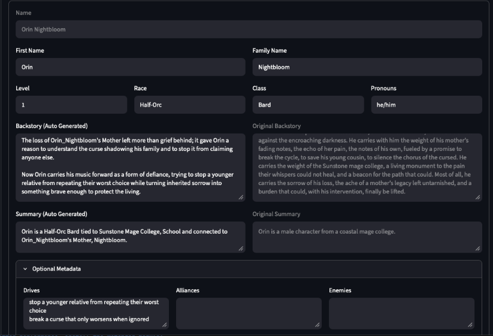
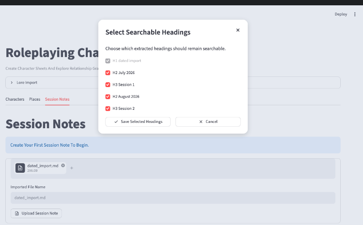
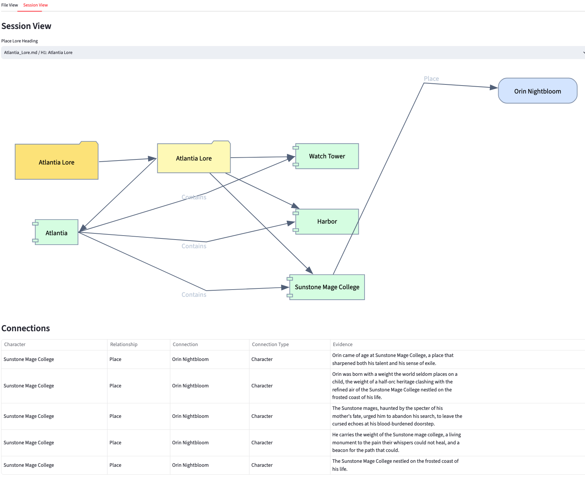

# Roleplaying Character Creator

A local Streamlit app for creating tabletop character sheets, organizing campaign lore, and visualizing relationships as knowledge graphs.

The app treats authored markdown in `world_building/lore` as the source of truth. Character sheets can be edited through the UI, places can be created as lore files, and derived graph JSON can be regenerated from the Markdown whenever needed.

- `world_building/` is intentionally ignored by git so each player can keep their own campaign data
- Generated runtime files are stored in `world_building/meta_data` while user-readable application docs are stored in `world_building/lore`
- Templates, specifications, and parsing rules are committed under `docs/`
- test lore examples live under `tests/fixtures`.

Backup lore files are stored in `world_building/backup` and are updated everytime the app is loaded.
A manual backup button has been added in the `Lore Import` Section for your convenience.

## Dependencies

- [Python 3.11](https://www.python.org/downloads/): Streamlit App
- [llama.cpp](https://github.com/ggml-org/llama.cpp): For Backstory Rewrites

## Running App

**`run_streamlit.sh` creation of local environment and dependency install for you**

- Launch the app through the command line `./run_streamlit.sh`
- Store local lore documents in the world_building directory
- Import local files through the UI or generate them through the app

Note: Character Rewrite feature is only enabled if the user has llama.cpp installed on their local machine. 
- Model download will be slow the first time it's run but then should run smoothly.  

## What It Does

- Create and edit character sheets with stats, backstory, summary, details, and character connections.
- Extracts session notes with date and session title info from either Markdown or raw text files.
- Build per-character knowledge graphs from character sheets.
- Use graph data to explicitly populate summaries or rewrite backstories when desired.

### Highlights

- Import session notes from raw text or markdown file.
- Extract the knowledge graph from the character backstory.
- Suggest graph-backed wording updates for character summary and backstory to improve writing legibility.
- All your data is stored locally on your machine.
- Graph-backed rewrite helpers never overwrite human edits to your character files.
- Character creator does not enforce a specific character schema or stats system.

## Release Notes


| Version | Summary                                                                                       |
| ------- | --------------------------------------------------------------------------------------------- |
| v2.0.0  | Adds local character rewrite tuning, rewrite quality reports, and safer generated-text saves. |
| v1.1.0  | Implemented distinct knowledge graph views for character, place and sesison tab               |
| v1.0.0  | This release adds a dedicated Knowledge Graph UI using graphviz.                              |
| v0.1.0  | Packaged as a Streamlit app for local character sheets, campaign lore management.             |

## Setup

The easiest way to run the app is:

```bash
./run_streamlit.sh
```

This helper script creates a local `.venv` environment if needed, installs the dependencies from `requirements.txt`, and starts the Streamlit app.

If you prefer to manage the environment manually, use:

```bash
python -m venv .venv
source .venv/bin/activate
pip install -r requirements.txt
streamlit run streamlit_app.py
```

## Knowledge Graph Views

Main Tab [Characters, Places, Session Notes]

- Characters: [Single Character, Party View]
- Places: [Location View, Heading View]
- Session Notes: [Location View, Directory File View]

### Project Screenshots


**Use local language model to clean up character summaries and backstories**


**Import session notes from external data sources extracting heading and date information**


**Generate knowledge graph from multiple data import sources and display information to users in clean readable format**

## Storage Source Of Truth

The repository uses committed project docs plus one ignored local workspace root:

- Only files under `world_building/lore` are treated as canonical authored campaign lore.
- Files under `world_building/import` are raw inputs and can be re-imported or reorganized.
- Files under `world_building/backup` are auto generated backups of lore and metadata which can be used for restoring old campaign notes and derived local state.
- Files under `world_building/meta_data` are derived or runtime data and can be rebuilt or regenerated from the lore.

## Project Layout

```text
docs/CHARACTER_TEMPLATE.md                  Character sheet template
docs/PLACE_TEMPLATE.md                      Place lore template
world_building/import/                      Raw markdown/text import staging area
world_building/lore/character_sheets/*.md   Authored character sheets
world_building/lore/character_sheets/*/BACKSTORY.md
                                            Alternate character sheet format
world_building/lore/places/*.md             Authored place lore
world_building/backup/                      Latest local Markdown backup
world_building/meta_data/character_metadata/*/PROFILE.json
                                            Runtime character metadata
world_building/meta_data/character_metadata/*/MEMORY.md
                                            Runtime memory notes
world_building/meta_data/character_graph/*.graph.json
                                            Derived per-character graph JSON
```

Everything under `world_building/` is local campaign material, runtime data, or generated output and should not be committed.

## Specs

- [Knowledge Graph Design](docs/specs/KNOWLEDGE_GRAPH_DESIGN.md): Tabular Knowledge Extraction
- [Combined Knowledge Graph](docs/specs/KNOWLEDGE_GRAPH_DESIGN2.md): Multi Source Knowledge Graph
- [Graphviz UI Issues](docs/specs/KNOWLEDGE_GRAPH_DESIGN3.md): Knowledge Graph Rendering with Graphviz
- [Knowledge Graph Views](docs/specs/KNOWLEDGE_GRAPH_DESIGN4.md): Multi View Knowledge Graphs

### Backstory and Summary Rewrites

Backstory and summary rewrites use the local llama.cpp command-line tools.
Install llama.cpp and the app will download the configured GGUF model the first time it needs it.

Recommended installs:

```bash
brew install llama.cpp        # macOS or Linux with Homebrew
winget install llama.cpp      # Windows
conda install -c conda-forge llama-cpp
```

The app calls the llama.cpp wrapper as `llama completion`, so verify that `llama` is on your `PATH`:

```bash
llama --version
llama completion --help
```

If your install only exposes `llama-cli`, install or link the llama.cpp wrapper before using model-backed rewrites. The app does not require `llama-server` or any long-running local API service.

After installing llama.cpp, start the app normally:

```bash
./run_streamlit.sh
```

The app stores downloaded local language model files in:

```text
models/character_rewrite/
```

That directory is ignored by git so the rewrite model is visible for local disk cleanup without being committed.

The default rewrite model is `Qwen/Qwen2.5-0.5B-Instruct-GGUF` using the `Q4_K_M` GGUF artifact. Advanced users can switch the JSON config to a smaller or larger GGUF model when they want to tune the speed/quality tradeoff.

Advanced users can change the model, quantization, download URL, and runtime settings in:

```text
config/model/local_language_model.json
```

When the app downloads the rewrite model for the first time, it prints the exact local directory before the download starts so you can remove the artifact later.

To choose a different model cache directory:

```bash
LOCAL_CHATBOT_MODEL_CACHE_DIR=/path/to/local/character_rewrite_models ./run_streamlit.sh
```

To regenerate the semantic improvement report with the real local model:

```bash
.venv/bin/python scripts/generate_single_character_backstory_rewrite_report.py
```
