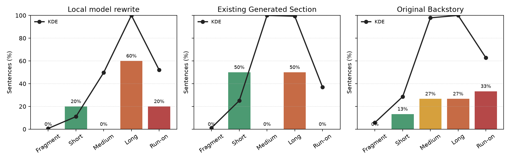

# Semantic Improvement Report: Orin Nightbloom

## Rewrite Engine

- Rewrite engine: `local-language-model-llama-cli`
- Evaluation: semantic similarity, sentence length fit, and sentence quality.

## Model Runtime

| Metric            | Value                                                |
| ----------------- | ---------------------------------------------------- |
| Model             | JustineF/Qwen2.5-1.5B-Instruct-Q4_K_M-GGUF           |
| Quantization      | Q4_K_M                                               |
| Prompt version    | character-rewrite-v7-local-qwen-1.5b-writing-quality |
| Max tokens        | 640                                                  |
| Temperature       | 0.75                                                 |
| Top P             | 0.85                                                 |
| Repeat penalty    | 1.15                                                 |
| Seed              | 2310                                                 |
| Context size      | 8192                                                 |
| Batch size        | 64                                                   |
| Threads           | 2                                                    |
| GPU layers        | 0                                                    |
| Device            | none                                                 |
| Timeout seconds   | 180                                                  |
| Prompt hash       | 02f0e87e27d4b079                                     |
| Prompt eval time  | 22484.59 ms                                          |
| Prompt tokens     | 679                                                  |
| Completion tokens | 477                                                  |
| Total tokens      | 1156                                                 |

## Candidate

### Local Model Rewrite

Orin Nightbloom is a Half-Orc Bard who excelled at Sunstone Mage College but came of age grappling with the weight of his heritage and the isolation it often leaves behind. His mother, an esteemed elven mage revered for her arcane knowledge, instilled in him a sense of responsibility to understand and prevent the curse shadowing their family history—a duty that became Orin's driving force. He sought not just mastery over magic but also redemption from the weight of his past choices and responsibilities.

Orin's drive is rooted deeply into breaking the curse that only worsens when ignored, stemming from a desire to avoid repeating generations' mistakes and honor her legacy in ways she could never have foreseen or understood. The lessons he learned at Sunstone Mage College sharpened not just as an individual but also as part of his community’s struggle against these ancient, unseen forces.

### Existing Generated Section

Orin Nightbloom is a Half-Orc Bard whose life has been shaped by the tension between legacy and self-invention. Orin came of age at Sunstone Mage College, a place that sharpened both his talent and his sense of exile.

The loss of Orin Nightbloom's Mother left more than grief behind; it gave Orin a reason to understand the curse shadowing his family and to stop it from claiming anyone else.

Now Orin carries his music forward as a form of defiance, trying to stop a younger relative from repeating their worst choice while turning inherited sorrow into something brave enough to protect the living.

### Original Backstory

Orin was born with a weight the world seldom places on a child, the weight of a half-orc heritage clashing with the refined air of the Sunstone Mage College nestled on the frosted coast of his life. He shouldered his lineage with the strength of a lineage elder, a duty his mother, a revered elven mage, instilled in him. He excelled, his magic a beacon in the night, but his untamed half-orc blood often felt at odds with the elegant halls and whispers of "less-than-pure lineage." He learned the lute and the stories woven through song, the solace found in melody rather than the strict, precise incantations favored at the college. But his world fractured when a lingering illness stole his mother from him, her death a chilling echo of a lingering, potent curse she carried.  A whispered tale, carried across the sea by the blood of his kin - a treacherous pact with a shadowy entity, one that poisoned her soul and, upon her death, amplified the affliction to its zenith, now bearing upon his soul.

Orin, consumed, poured over his mother's forgotten grimoires, a desperate tapestry of fading notes and the weight of a legacy. The Sunstone mages, haunted by the specter of his mother's fate, urged him to abandon his search, to leave the cursed echoes at his blood-burdened doorstep. He saw, however, not a path to abandonment, but a pull. The whispers of the curse intensified, each night a chorus of his mother’s fading pain and the entity's malicious glee. His conviction hardened, a burning ember within his chest - to sever this lineage-bound torment, to be the anchor that saved his kin from the self-same oblivion. He trained his voice and soul, not for the mage-elitist courts of the college, but for a different stage, one where his lineage wouldn't be a whisper of shame, but a defiant roar against the shadows.

Orin now sees his path illuminated: a bard, a weaver of defiance, his music is a shield against the encroaching darkness. He carries with him the weight of his mother’s fading notes, the echo of her pain, the notes of his own, fueled by a promise to break the cycle, to save his young cousin, to silence the chorus of the cursed. He carries the weight of the Sunstone mage college, a living monument to the pain their whispers could not heal, and a beacon for the path that could. Most of all, he carries the sorrow of his loss, the ache of a mother’s legacy left untarnished, and a burden that could, with his intervention, finally be lifted.

## Scores

| Candidate                  | Status   | Overall | Similarity | Sentence Length Score | Sentence Quality |
| -------------------------- | -------- | ------: | ---------: | --------------------: | ---------------: |
| Local model rewrite        | Rejected | 59.71   | 67.07      | 59.20                 | 68.67            |
| Existing Generated Section | Accepted | 75.88   | 73.34      | 75.00                 | 82.29            |
| Original Backstory         | Source   | 54.70   | 78.75      | 56.53                 | 51.29            |

## Sentence Lengths

## Result

The local model rewrite changes the writing quality score versus the original section by `0.0501`.
