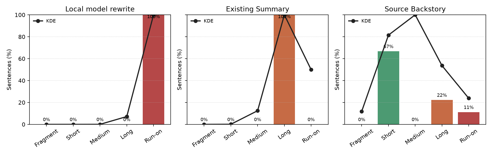

# Semantic Summary Improvement Report: Jory Ravenmark

## Rewrite Engine

- Rewrite engine: `local-language-model-llama-cli`
- Evaluation: semantic similarity, sentence length fit, and sentence quality.

## Model Runtime

| Metric            | Value                                                |
| ----------------- | ---------------------------------------------------- |
| Model             | JustineF/Qwen2.5-1.5B-Instruct-Q4_K_M-GGUF           |
| Quantization      | Q4_K_M                                               |
| Prompt version    | character-rewrite-v7-local-qwen-1.5b-writing-quality |
| Max tokens        | 640                                                  |
| Temperature       | 0.75                                                 |
| Top P             | 0.85                                                 |
| Repeat penalty    | 1.15                                                 |
| Seed              | 2310                                                 |
| Context size      | 8192                                                 |
| Batch size        | 64                                                   |
| Threads           | 2                                                    |
| GPU layers        | 0                                                    |
| Device            | none                                                 |
| Timeout seconds   | 180                                                  |
| Prompt hash       | be814e180e8ec290                                     |
| Prompt eval time  | 10491.74 ms                                          |
| Prompt tokens     | 467                                                  |
| Completion tokens | 94                                                   |
| Total tokens      | 561                                                  |

## Candidate

### Local Model Rewrite

Jory Ravenmark is a Human Barbarian haunted by the loss of her family and an inexplicable mercy shown by a monstrous leviathan that has driven her to blend nomadic hunter-memories with a burning oath to track and face the beast she seeks to vanquish.

### Existing Summary

Haunted by the loss of her family and the inexplicable mercy shown by a monstrous leviathan, Jory Ravenmark blends her nomadic hunter-memories with a burning oath to track and face the beast.

### Source Backstory

Jory was a sailor and grew up with her family on a island watchtower. Her mother died at sea and her father was consumed by loneliness which drove him to drink heavily. When she was still but a child, a monster from the sea attacked the watchtower. Jory survived, but both her fathers were consumed by the beast and vanished without a trace. That night Jory decided to dedicate her life to tracking down the beast who killed her father.

She learned to read the open sea as her father once had before her. She greaved his passing terribly and would do anything in her power to bring him back, although she knew in her heart that that was not possible. She longed for the days they could sit together in front of the fire in peace, him siping his glass of wisky and her with her steaming cup of hot cooca.

Jory Ravenmark directed her grief to become a beacon of light to her community helping others who had lost love ones to the sea work on rebuilding their lives into something their ancestors would be proud of.

## Scores

| Candidate           | Status   | Overall | Summary Length Score | Similarity | Sentence Length Score | Sentence Quality |
| ------------------- | -------- | ------: | -------------------: | ---------: | --------------------: | ---------------: |
| Local model rewrite | Rejected | 46.76   | 100.00               | 68.29      | 0.00                  | 17.86            |
| Existing Summary    | Rejected | 44.21   | 100.00               | 72.24      | 48.00                 | 62.50            |
| Source Backstory    | Source   | 54.87   | 31.75                | 90.26      | 72.89                 | 84.26            |

## Sentence Lengths

## Result

The local model rewrite changes the writing quality score versus the original section by `-0.0811`.
